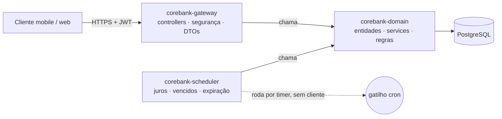
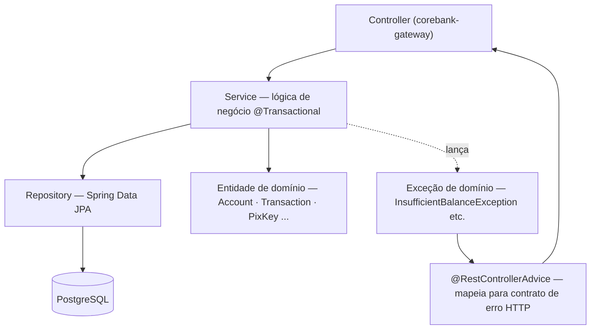
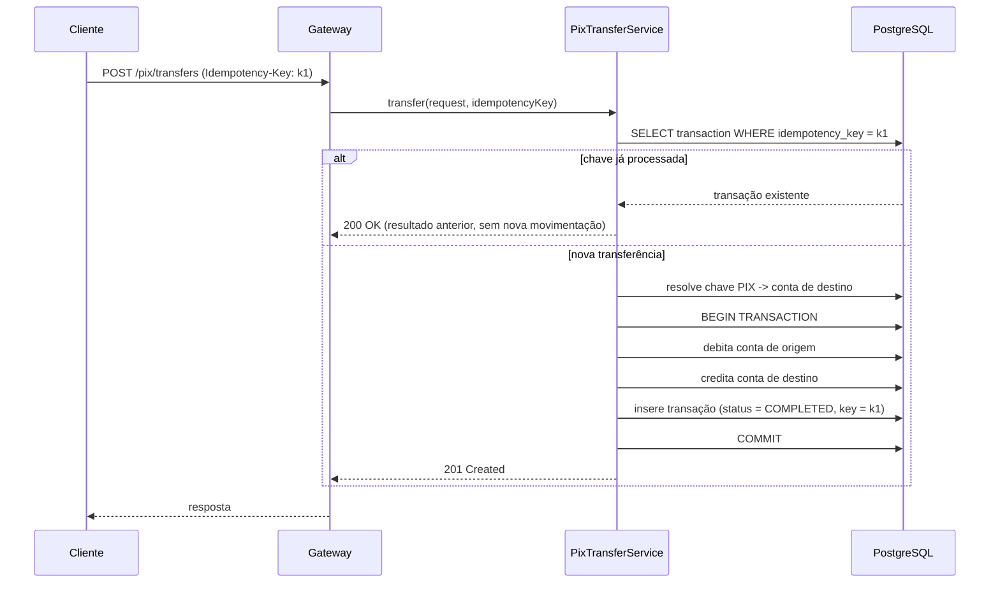
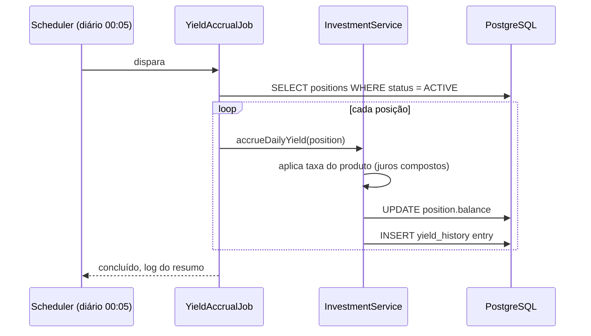
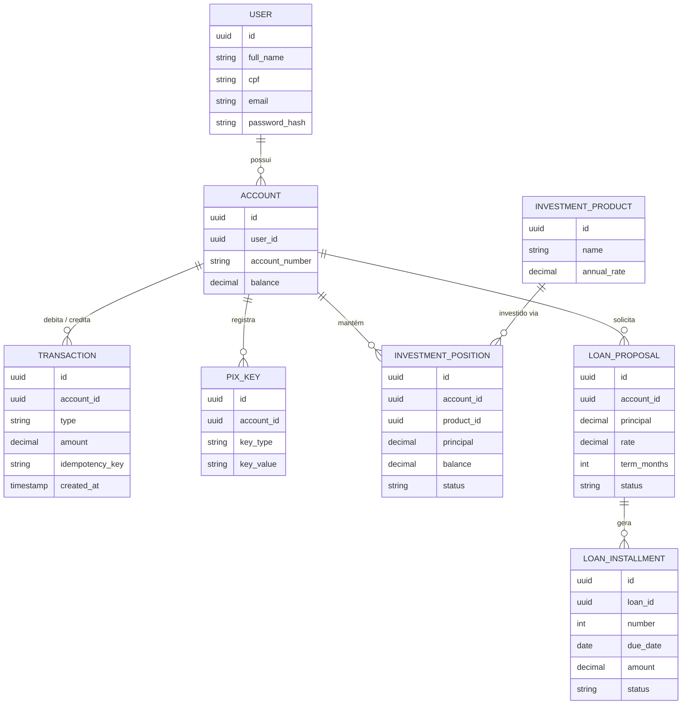

# Core Bank — Arquitetura do Sistema

> Versão em Markdown do doc de arquitetura original (artifact privado). Esta é a fonte de verdade versionada — se um dia divergir do artifact, este arquivo vence, por estar no histórico do Git e acessível a todo o time sem depender de permissão de link.

Uma plataforma de banco digital construída como projeto pessoal de estudo: gestão de contas, transferências internas, PIX simulado, investimentos e empréstimos, estruturada da mesma forma que um sistema bancário real é dividido em módulos, camadas e processos agendados.

- **Pacote base:** `com.corebank`
- **Stack:** Java 21 · Spring Boot 4.1.1 · PostgreSQL 16 · Flyway · JWT

## 1. Arquitetura de módulos

O Core Bank é entregue como três módulos Maven sob um build pai (`corebank-parent`).

| Módulo | Responsabilidade | Depende de |
|---|---|---|
| `corebank-gateway` | Único módulo exposto ao mundo externo. Controllers por feature, validação de requisição, autenticação JWT, exception handling. | `corebank-domain` |
| `corebank-domain` | O banco em si. Entidades JPA, repositórios, services transacionais com toda a regra de negócio (saldo, juros, aprovação de empréstimo). | Nada dos outros dois módulos |
| `corebank-scheduler` | Tudo que não é disparado por requisição de usuário: acúmulo de juros, detecção de parcela vencida. Chama os services de domínio diretamente, no mesmo processo. | `corebank-domain` |



**Regra estrutural:** `corebank-domain` nunca importa nada de `corebank-gateway` ou `corebank-scheduler`. Essa é a única regra que mantém a lógica de negócio testável sem precisar subir HTTP ou um scheduler.

## 2. Camadas dentro do corebank-domain



**Regra de posicionamento de service:** um `@Service` mora em `corebank-domain` sempre, mesmo que hoje só o gateway o chame. A pergunta "onde eu coloco essa lógica?" nunca depende de quem chama hoje — só existe uma resposta.

Fluxo padrão (exemplo real, cadastro de usuário):

```
Cliente HTTP → RegisterUserRequest (gateway, com @Valid)
                    ↓ controller converte
            RegisterUserCommand (domain, dados puros, sem anotação de validação)
                    ↓ passado pro service
      UserRegistrationService.register(command)  (domain, roda a lógica)
```

O `corebank-gateway` só define DTOs de requisição/resposta e controllers finos que convertem esses DTOs em um `Command` próprio do domínio antes de chamar o service. O domínio nunca enxerga o formato HTTP.

## 3. Fluxo de transferência PIX

O fluxo que mais exige cuidado: precisa ser idempotente (retry do cliente nunca move dinheiro duas vezes) e atômico (débito e crédito acontecem juntos ou nenhum dos dois acontece).



## 4. Fluxo de rendimento de investimento (agendado)

Diferente das transferências, não tem cliente esperando — o `corebank-scheduler` acorda uma vez por dia e atualiza cada posição em aberto.



## 5. Modelo de dados principal

Relacionamentos simplificados cobrindo as fases até Empréstimos. Toda tabela que movimenta dinheiro carrega um `idempotency_key` ou é escrita dentro de uma única transação — nunca as duas coisas soltas.



## 6. Fases de entrega

Cada fase entrega um pedaço funcional do banco, não um esqueleto vazio — mesma divisão rastreada card a card no Trello.

| Fase | Nome | Entregas principais |
|---|---|---|
| 0 | Fundação | Build multi-módulo, PostgreSQL + Flyway, Docker Compose, CI, Spotless |
| 1 | Auth & Contas | Modelo User + Account, BCrypt, login JWT, refresh token, saldo & extrato |
| 2 | Transferências Internas | Modelo Transaction, transferência atômica, validação de saldo, testes de concorrência |
| 3 | PIX (simulado) | CRUD de chave PIX, transferência instantânea, idempotência, histórico |
| 4 | Investimentos | Modelo produto + posição, aplicar/resgatar, job de rendimento diário, testes |
| 5 | Empréstimos | Simulação, aprovação, cronograma de parcelas, job de vencidos |
| 6 | Produção / Hardening | Contrato de erro, docs OpenAPI, logging estruturado, rate limiting, Docker, checklist OWASP |

Ordem detalhada card a card, com dependências e como dividir entre pessoas: ver o doc de Fluxo de Desenvolvimento (linkado no `CLAUDE.md`) e o board Trello "Core Bank".

## 7. Referência de stack técnica

| Área | Escolha | Por quê |
|---|---|---|
| Linguagem | Java 21 | LTS, records e pattern matching simplificam o código de domínio |
| Framework | Spring Boot 4.1.1 | Padrão de mercado para essa stack |
| Persistência | Spring Data JPA + PostgreSQL | Integridade relacional importa para dinheiro; PostgreSQL é gratuito e pronto para produção |
| Migrations | Flyway | Mudanças de schema versionadas, revisáveis em PRs |
| Auth | Spring Security + JWT | Autenticação stateless, padrão para APIs mobile-first |
| Build | Maven multi-módulo | Impõe os limites entre módulos em tempo de compilação |
| Docs | springdoc-openapi (planejado, fase 6) | Swagger UI gerado a partir do código, nunca fica desatualizado |
| Ambiente local | Docker Compose | Um comando para subir Postgres |
| CI | GitHub Actions | Gratuito para repositórios públicos, alinhado com o fluxo Code Review → QA do Trello |

---

Core Bank é um projeto pessoal de estudo inspirado em bancos digitais como o Nubank. Todos os dados, transferências e cálculos de juros são simulados — nenhum dinheiro real é movimentado.
